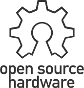

# scrimp-bot-v2
Make a bot from what you've got

Tier|Bot|Reason
|-|-|-|
|S| ? scrimp bot v2 | +Simple +Strong|
|A||
|B|scrimp bot v1 | +Functional +Frugal -Fragile -Fortissimo -Flawed|
|C||
|F||

## Goal

For about 100 USD, build an arm that can lift regular objects around in a regular working space.

## Free
Scrimp bot is free hardware.

